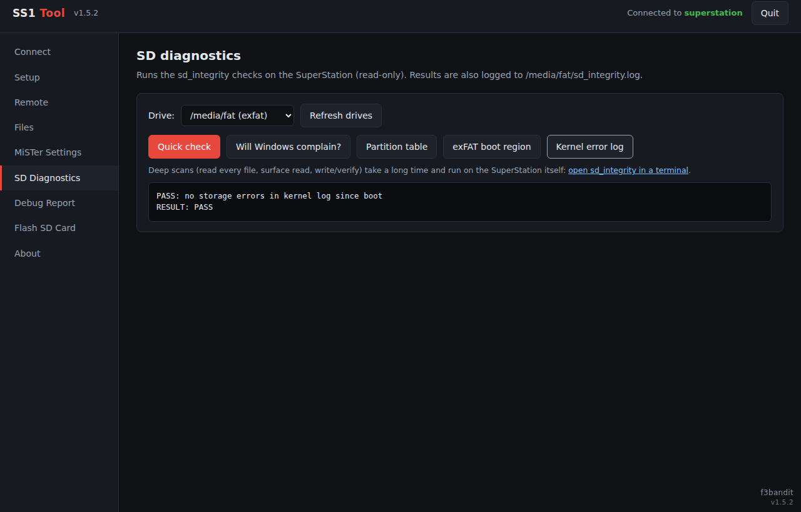

<p align="center">
  
</p>

<h1 align="center">SS1 Tool</h1>

<p align="center">
  <b>Unofficial SuperStation One toolkit for Windows</b><br>
  One exe, no install. Connects to your SS1 over the network and runs in your web browser.
</p>

<p align="center">
  <a href="../../releases/latest"><b>⬇ Download the latest release</b></a>
  &nbsp;·&nbsp;
  <a href="https://discord.gg/74pb5PJRxX"><b>💬 Taki Udon Discord</b></a>
</p>

> [!WARNING]
> Community project. Not affiliated with or endorsed by Taki Udon or Retro Remake.
> Back up your SD card before flashing it or editing configuration files.

---

## Contents

- [Screenshots](#screenshots)
- [Features](#features)
- [Getting started](#getting-started)
- [Requirements](#requirements)
- [Using the scripts without the app](#using-the-scripts-without-the-app)
- [Where things are stored](#where-things-are-stored)
- [Privacy and security](#privacy-and-security)
- [Reporting a problem](#reporting-a-problem)
- [Building from source](#building-from-source)
- [Project layout](#project-layout)
- [Credits](#credits)

## Screenshots

| Connect | Remote |
|---|---|
|  |  |
| **Files** | **MiSTer Settings** |
|  |  |
| **Setup** | **SD Diagnostics** |
|  |  |

## Features

### Connect
- Connect by IP address (default login `root` / `1`)
- Saved devices with one-click **Connect**, **Rename** and **Delete**
- Status panel: kernel, `/MiSTer.version`, Console Mode, Samba, `update_linux`, installed scripts and free space

### Setup
- Install the SS1 scripts: `sd_integrity.sh`, `shutdown.sh` and `ss1_debug_report.sh`
- Enable Samba at boot, so the SD card shows up in Windows as `\\IP\sdcard`
- Install the latest [Update All](https://github.com/theypsilon/Update_All_MiSTer) and set `downloader.ini` to the MiSTer-devel distribution with `update_linux = false`, which protects Console Mode's kernel
- Remove the faulty `fix_sd_overlap.sh` / `exfat_fix_overlap` tool, which misreads the correct SS1 partition layout as overlapping ([SuperStation-Documentation #14](https://github.com/Takiiiiiiii/SuperStation-Documentation/issues/14))
- Save your own ScreenScraper login and TheGamesDB API key for Console Mode, with the installed values shown under each field

### Remote
- On-screen controller: D-pad, A/B/X/Y, Select, Start and OSD, with hold-to-press
- Remote keyboard: on-screen keys and live key capture
- Reload the menu, reboot, safe shutdown, open an SSH terminal or the Samba share

### Files
- Two-pane file manager with a drive picker on each side
- Copy and move between the SD card and the NVMe/USB drive; the copy runs on the SS1 itself, so nothing goes through your PC
- Upload, download (folders as zip), rename, delete and create folders; system folders are protected

### MiSTer Settings
- Edit `MiSTer.ini`, `downloader.ini`, Console Mode's `config.ini` and every ini in `ConsoleMode/themeconfig`, including `section_groups`
- **SS1 HDMI fix**: shows and comments out the MiSTer.ini settings the SS1 doesn't support (`hdmi_cec`, `hdmi_cec_input_mode`, `hdmi_cec_power_on`, `hdmi_cec_sleep`, `hdmi_cec_wake`, `hdmi_cec_clock`, `hdmi_off`, `video_off_logo`); a backup is made first
- Backups saved on your PC in a `backups` folder next to the exe: each backup gets its own folder named after what you type plus the date and time, with category folders inside and the original file names kept
- Back up the selected file or all ini files at once; **Restore all** or **Restore file** for any backup, plus Show in Explorer and Delete
- An automatic backup is taken before every change the tool makes

### SD Diagnostics (SD card or NVMe)
- Quick check: partition table and overlap, exFAT boot region checksums, kernel I/O errors
- **"Will Windows complain?"**: checks whether the exFAT dirty flag clears, which is what makes Windows offer to scan the card
- Deep scans: read every file, full surface read, and a write/verify test that detects failing or fake-capacity cards

### Debug Report
- One click collects versions, configs, Console Mode and themeconfig files, game library layout, storage health and logs into a single text file for Taki and the mods
- Starts with an automatic **FINDINGS** summary of known problems, including whether the SS1 HDMI fix is applied
- Passwords, keys, tokens, WiFi names and MAC addresses are redacted
- A Save As window lets you store it anywhere

### Flash SD Card
- Downloads the latest official [SuperStation One SD Card Installer](https://github.com/Retro-Remake/SuperStation-SD-Card-Installer/releases) and writes it to a card, then reads it back to verify
- Only SD and USB card readers are listed; internal and boot drives are never shown
- You must type the disk number to confirm before anything is erased

## Getting started

1. Download `SS1Tool.exe` from the [latest release](../../releases/latest).
2. Run it. Windows SmartScreen will warn because the exe is unsigned: click **More info → Run anyway**.
3. A console window opens along with the tool in your web browser.
4. Enter your SS1's IP address and click **Connect**. You can find the IP at the bottom of the MiSTer main menu or in Console Mode's network settings.
5. Click **Save as device** so next time it's one click.

To close the tool, click **Quit** in the top right corner or close the console window.

## Requirements

- Windows 10 or 11, 64-bit
- The SuperStation One on the same network as your PC
- The SSH terminal buttons need Windows' built-in OpenSSH client (**Settings → Apps → Optional features → OpenSSH Client**)
- Flashing an SD card needs administrator rights; the tool offers to restart itself as administrator

## Using the scripts without the app

The SS1 scripts also work on their own. Copy them to `/media/fat/Scripts/` and run them from the MiSTer **Scripts** menu with a controller, or over SSH:

```bash
ssh -t root@<SS1-IP> "bash /media/fat/Scripts/sd_integrity.sh"
```

| Script | What it does |
|---|---|
| `sd_integrity.sh` | Controller-driven menu of storage checks for the SD card or NVMe. Results are logged to `/media/fat/sd_integrity.log`. |
| `shutdown.sh` | Flushes all writes, marks the drives clean where possible, shows **SAFE TO POWER OFF** and halts. It doesn't stop Bluetooth, which avoids the `RememberPowered` problem from [Scripts_MiSTer #36](https://github.com/MiSTer-devel/Scripts_MiSTer/issues/36). |
| `ss1_debug_report.sh` | Writes `/media/fat/SS1_debug_report_<date>.txt` for support requests. |

`sd_integrity.sh` also has a non-interactive mode:

```bash
bash /media/fat/Scripts/sd_integrity.sh --run quick|windows|partition|boot|kernel [/media/fat|/media/usb0]
```

## Where things are stored

| What | Where |
|---|---|
| Settings and saved devices | `%APPDATA%\SS1Tool\config.json` |
| ini backups | `backups\` next to `SS1Tool.exe`, e.g. `backups\before_HDMI_fix_2026-10-03_15-42-08\MiSTer\MiSTer.ini`. Categories: `MiSTer`, `Downloader`, `ConsoleMode`, `ConsoleMode\themeconfig`, `ConsoleMode\themeconfig\section_groups` |
| Downloaded SD installer images | `%LOCALAPPDATA%\SS1Tool\images\` |
| Debug reports | Wherever you choose in the Save As window |
| On the SS1 | Scripts in `/media/fat/Scripts/`; the keyboard helper runs from `/tmp` (RAM) and is gone after a reboot |

## Privacy and security

- The app only listens on `127.0.0.1` (your own PC), and every request needs a random session token.
- No telemetry, no accounts, no cloud services. The only internet access is to GitHub, to download Update All and the SD installer, and to TheGamesDB, to test an API key you enter.
- Saved devices store the name, IP and user only, never the password.
- Scraper logins are written only to your SS1, in `/media/fat/ConsoleMode/`.
- The SS1 is reached over SSH with host-key checking off, because the SS1 creates new host keys every time it's reflashed. Only use the tool on networks you trust.

## Reporting a problem

1. Open the **Debug Report** tab and click **Create debug report**.
2. Save the file and attach it to a new [issue](../../issues), or post it in the [Taki Udon Discord](https://discord.gg/74pb5PJRxX).

Please say which version you're using; it's shown in the bottom right corner of the app.

## Building from source

Needs [Go](https://go.dev/) 1.22 or newer. Run these from the project folder:

```bash
# 1. Keyboard/controller helper that runs on the SS1 (32-bit ARM)
CGO_ENABLED=0 GOOS=linux GOARCH=arm GOARM=7 go build -ldflags "-s -w" -o bin/ss1kbd_arm ./kbdhelper

# 2. Windows icon resource (only needed if you change icon/ss1tool.ico)
go install github.com/akavel/rsrc@latest
rsrc -ico icon/ss1tool.ico -arch amd64 -o rsrc_windows_amd64.syso

# 3. The app
GOOS=windows GOARCH=amd64 go build -trimpath -ldflags "-s -w" -o SS1Tool.exe .
```

For development on Linux or macOS, `go build .` produces a version without the Windows-only features (flashing, terminal windows, Save As dialogs) that you can run against a real SS1.

## Project layout

| Path | Contents |
|---|---|
| `main.go` | Local web server, session token, config |
| `sshclient.go` | SSH connection, command and upload helpers |
| `actions.go` | Status, setup, Samba, Update All, scraper, ini editor, HDMI fix, diagnostics, debug report, file manager |
| `features2.go` | Remote keyboard and controller, saved devices, drive transfers, ini backups |
| `platform_windows.go` | Explorer, terminal, Save As dialog, disk listing and SD flashing |
| `kbdhelper/` | Virtual keyboard and controller program for the SS1 |
| `scripts/` | The SS1 scripts embedded in the app |
| `web/index.html` | The user interface |
| `icon/` | App icon |

## Credits

Developed by **f3bandit**.

Special thanks to **Taki Udon** and the team, and all the admins on the Taki Discord.

<p><a href="https://discord.gg/74pb5PJRxX"><b>💬 Join the Taki Udon Discord</b></a></p>

SuperStation One, Console Mode and MiSTer belong to their respective owners. This project uses [x/crypto/ssh](https://pkg.go.dev/golang.org/x/crypto/ssh) and downloads [Update All](https://github.com/theypsilon/Update_All_MiSTer) and the official [SS1 SD Card Installer](https://github.com/Retro-Remake/SuperStation-SD-Card-Installer) at runtime.

## License

<!-- Add a LICENSE file to the repo and name it here, e.g. GPL-3.0 -->
See [LICENSE](LICENSE).
