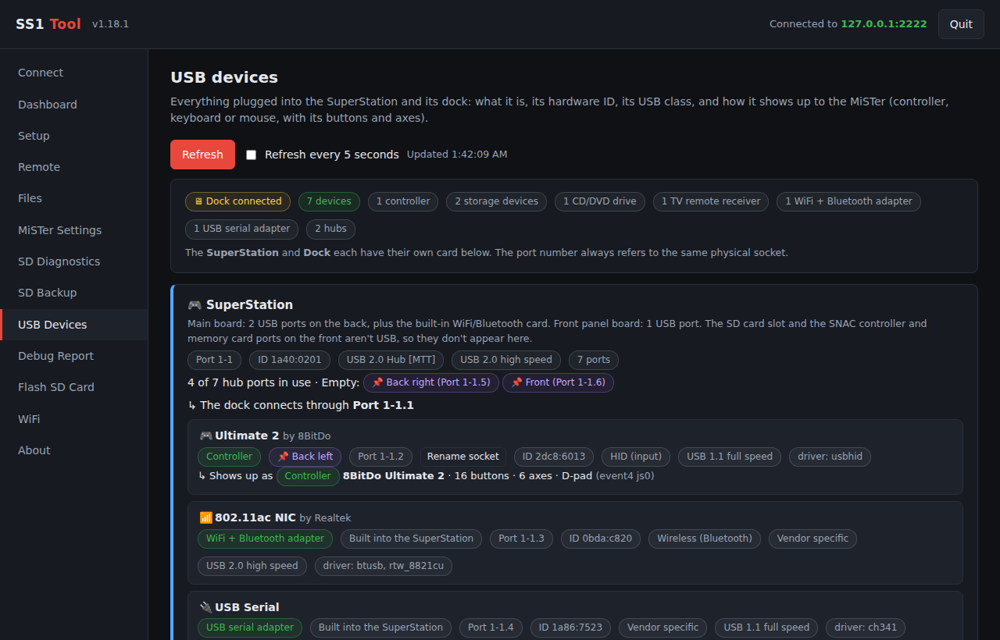

<p align="center">
  
</p>

<h1 align="center">SS1 Tool</h1>

<p align="center">
  <b>Unofficial setup, diagnostics and support tool for the SuperStation One</b><br>
  One Windows exe, no install. Connects to your SS1 over the network and runs in your web browser.
</p>

<p align="center">
  <a href="../../releases/latest"><b>⬇ Download the latest release</b></a>
  &nbsp;·&nbsp;
  <a href="https://discord.gg/74pb5PJRxX"><b>💬 Taki Udon Discord</b></a>
</p>

> [!WARNING]
> Community project. Not affiliated with or endorsed by Taki Udon or Retro Remake.
> Back up your SD card before flashing it or editing configuration files.

---

## What is SS1 Tool?

SS1 Tool helps SuperStation One owners set up their system correctly, avoid the problems that come up most often, and get help quickly when something does go wrong.

It's built around three jobs:

- **Setup:** get a new or freshly flashed SS1 configured the right way. The **★ Wizard** walks a new owner through everything, from flashing the SD card to WiFi, scripts and Update All.
- **Diagnostics:** check the SD card, NVMe drive and configuration for known problems.
- **Support:** create one debug report you can post in the [Taki Udon Discord](https://discord.gg/74pb5PJRxX), so the admins can see exactly what's on your system instead of asking question after question.

### Problems it helps prevent

| Problem | How SS1 Tool helps |
|---|---|
| **Linux kernel updates breaking cores or front ends** (see [below](#linux-kernel-updates-and-the-stable-lane)) | Installs Update All with `update_linux = false` and the MiSTer-devel distribution, shows whether those settings are in place, and shows the current [Linux update advisory](#linux-update-advisory) |
| **Broken or mistyped `MiSTer.ini`** | Edit it from your PC with an automatic backup before every change, plus named and timestamped backups you can restore in one click |
| **HDMI settings the SS1 doesn't support** | The SS1 HDMI fix comments out the HDMI-CEC, `hdmi_off` and `video_off_logo` settings and shows the state of each one |
| **SD card problems:** corrupted cards, the faulty `fix_sd_overlap` tool, Windows asking to scan the card, failing or fake-capacity cards | Removes the faulty overlap tool, checks the partition table and exFAT health, tests whether Windows will complain, runs deep read/write tests, adds a safe shutdown, and flashes the official SS1 SD Card Installer |
| **Hard-to-explain problems** | One click creates a debug report with versions, configs, storage health and logs, ready to post in the Taki Udon Discord. Passwords, keys, WiFi names and MAC addresses are redacted. |

### What it isn't

SS1 Tool is **not a replacement for [MiSTer Companion](https://github.com/Anime0t4ku/mister-companion)** or other general MiSTer management apps. It doesn't try to manage your game library, saves, artwork or cores. It focuses on the SuperStation One's setup, diagnostics and support needs, and works alongside whatever other tools you already use. The remote control and file manager are there to help with setup and troubleshooting.

### Linux kernel updates and the stable lane

A Linux kernel update delivered through Update All broke some hybrid cores, such as **Street Fighter III: 3rd Strike**, **Quake** and **Duke Nukem 3D**, as well as front ends including Console Mode. Many owners had to reflash their SD card to recover. That problem has since been fixed.

Kernel updates can still bring breaking changes in the future, though. SS1 Tool keeps your SS1 in a more stable lane: with `update_linux = false`, Update All still updates your cores and the MiSTer menu, but leaves the Linux kernel alone. You don't have to worry about a breaking kernel change forcing you to reflash your SD card again.

### Linux update advisory

SS1 Tool also shows whether Linux updates are currently considered **safe** or **not recommended**. This advisory is maintained by hand in [`update_flags/`](https://github.com/f3bandit/ss1_tool/tree/main/update_flags) in this repo and updated when a problem is found or resolved. The app reads it from GitHub each time you open it, so you always see the latest status without updating the tool. It appears in **Setup → Update All** and in the **System status** panel:

| Status | What it means |
|---|---|
| ✓ **Reported safe** | No known problems with the current Linux update. Keeping `update_linux = false` is still the most stable choice. |
| ⚠ **NOT recommended** | A known problem exists; the reason is shown. If your SS1 still has Linux updates turned on, the tool tells you to click **Install Update All + apply settings**. |
| No advisory | Nothing has been published right now. |

The advisory is only information. SS1 Tool never changes your settings by itself.

<details>
<summary>Advisory file format (for maintainers)</summary>

- `update_flags/linux_update.ini` contains one line: `Linux_update = safe` or `Linux_update = unsafe`. Any other value shows as "No advisory".
- `update_flags/linux_update_readme.ini` contains a short plain-text explanation, shown to users under the status.

</details>

---

## Contents

- [What is SS1 Tool?](#what-is-ss1-tool)
- [Linux kernel updates and the stable lane](#linux-kernel-updates-and-the-stable-lane)
- [Linux update advisory](#linux-update-advisory)
- [Screenshots](#screenshots)
- [Features](#features)
- [Getting started](#getting-started)
- [Requirements](#requirements)
- [Using the scripts without the app](#using-the-scripts-without-the-app)
- [Where things are stored](#where-things-are-stored)
- [Privacy and security](#privacy-and-security)
- [Reporting a problem](#reporting-a-problem)
- [Building from source](#building-from-source)
- [Project layout](#project-layout)
- [Credits](#credits)

## Screenshots

| Wizard | Dashboard |
|---|---|
|  |  |
| **Connect** | **Setup** |
|  |  |
| **Remote** | **Files** |
|  |  |
| **MiSTer Settings** | **SD Diagnostics** |
|  |  |
| **SD Backup** | **Flash SD Card** |
|  |  |
| **USB Devices** | **WiFi** |
|  |  |
| **Screenshots** | **Controllers** |
|  |  |
| **About** | |
|  | |

## Features

### Connect
- Connect by IP address (default login `root` / `1`)
- Saved devices with one-click **Connect**, **Rename** and **Delete**
- Status panel: kernel, `/MiSTer.version`, Console Mode, Samba, `update_linux`, scraper login, installed scripts and free space
- A pop-up tells you when the SS1 is switched off, restarts or drops off the network, with a **Reconnect** button

### Wizard (first-time setup)
Open **★ Wizard** (bottom left of the menu, always visible). It walks a new owner through everything, one step at a time, and remembers where you left off:
1. Pick the SD card from a list (only SD/USB card readers are shown)
2. Choose the **Console Mode** or **Regular** image from the latest official release
3. Download, install and verify it (a pop-up confirms before anything is erased)
4. Put the card in the SuperStation and let its installer finish
5. Finish setup **over the network** (Ethernet) or with the **SD card back in this PC**
6. WiFi (optional), scripts (SS1 + community), Update All stable lane, Samba, overlap tool check, and ScreenScraper / TheGamesDB (optional)

### Dashboard
- Live health of the SS1's Linux side, refreshed every 3 seconds: CPU use and load with the number of cores and threads and a bar for each thread, memory, storage space on the SD card and USB/NVMe drives, network traffic with a download/upload graph, uptime, the current core, running processes (busiest first), and temperature on hardware that has a sensor
- Kernel log viewer (last 20 to 200 messages) for tracking down controllers, WiFi adapters or drives that keep disconnecting

### USB Devices
- Separate **SuperStation** and **Dock** cards: the console's own sockets and built-in parts (such as the WiFi/Bluetooth card), and the dock's sockets, NVMe slot and the TV remote receiver. Shows whether the dock is connected, plus a card for the USB host controllers
- For each device: name and maker, its type (controller, keyboard, mouse, storage, IR remote receiver, WiFi/Bluetooth adapter, USB serial adapter and so on), hardware ID (vendor:product), USB class, speed, driver, and its **port number**, which always refers to the same physical socket
- How it shows up to the MiSTer: **controller**, **keyboard** or **mouse**, with its number of buttons, keys and axes, D-pad and rumble support
- **Bluetooth controllers** are listed too, and **virtual devices** (such as SS1 Tool's Remote keyboard and controller) are shown separately so they aren't mistaken for real hardware
- **Name your sockets** (e.g. *Back left*, *Front*, *Dock 1*): the name sticks to that physical socket, and named sockets show as empty when nothing is plugged in
- Recognizes the dock's built-in NVMe slot, CD/DVD drive and TV remote receiver (`pico_ir_keyboard` by TinyUSB, which shows up as a keyboard and mouse), and notes that the SNAC ports (front, and the dock port labeled SNAC) aren't USB
- USB drives show their size and where they're mounted; recent USB connection errors from the kernel log are listed, tagged Dock or SuperStation

### Setup
Each item shows its current status on the SS1 (installed, up to date, enabled, running, settings applied).
- Install the SS1 scripts: `sd_integrity.sh`, `shutdown.sh` and `ss1_debug_report.sh`
- Install or update community scripts straight from their authors: [Reflex Adapt Manager](https://github.com/misteraddons/Reflex-Adapt) (MiSTer Addons) and [PSX BIOS Patcher](https://gist.github.com/IncognitoMan/fd1f9fbd5794af83370a5c6b02b7d6ee) (IncognitoMan)
- Enable Samba at boot, so the SD card shows up in Windows as `\\IP\sdcard`
- Install the latest [Update All](https://github.com/theypsilon/Update_All_MiSTer) and set `downloader.ini` to the MiSTer-devel distribution with `update_linux = false`, so cores and the menu keep updating while the Linux kernel stays put
- Shows the current [Linux update advisory](#linux-update-advisory) from this repo
- Remove the faulty `fix_sd_overlap.sh` / `exfat_fix_overlap` tool, which misreads the correct SS1 partition layout as overlapping ([SuperStation-Documentation #14](https://github.com/Takiiiiiiii/SuperStation-Documentation/issues/14))
- Save your own ScreenScraper login and TheGamesDB API key for Console Mode, with the installed values shown under each field

### Remote
- On-screen controller: D-pad, A/B/X/Y, Select, Start and OSD, with hold-to-press
- Remote keyboard: on-screen keys and live key capture
- Reload the menu, reboot, safe shutdown, open an SSH terminal or the Samba share
- **Safe shutdown** shows its progress and **SAFE TO POWER OFF** on the screen connected to the SS1, even while the Console Mode UI is showing

### Files
- Two-pane file manager with a drive picker on each side
- Copy and move between the SD card and the NVMe/USB drive; the copy runs on the SS1 itself, so nothing goes through your PC
- Upload, download (folders as zip), rename, delete and create folders; system folders are protected

### Screenshots
- **Take a screenshot** of whatever is running on the SuperStation from your PC, with an optional name and an option for the scaled picture as shown on the TV. It's saved on the SS1 and copied to `backups\screenshots\<core>\` next to SS1Tool.exe
- Two cards, **On this PC** and **On the SD card**, each with a scrolling list and a built-in viewer
- On this PC: show in folder, open full size, delete. On the SD card: copy one or all to this PC, open full size, delete from the SD card
- Works while a game or core is running; the MiSTer menu and Console Mode's own screens can't be captured

### MiSTer Settings
- Edit `MiSTer.ini`, `downloader.ini`, Console Mode's `config.ini` and every ini in `ConsoleMode/themeconfig`, including `section_groups`
- **SS1 HDMI fix**: shows and comments out the MiSTer.ini settings the SS1 doesn't support (`hdmi_cec`, `hdmi_cec_input_mode`, `hdmi_cec_power_on`, `hdmi_cec_sleep`, `hdmi_cec_wake`, `hdmi_cec_clock`, `hdmi_off`, `video_off_logo`); a backup is made first
- Backups saved on your PC in a `backups` folder next to the exe: each backup gets its own folder named after what you type plus the date and time, with category folders inside and the original file names kept
- Back up the selected file or all ini files at once; **Restore all** or **Restore file** for any backup, plus Show in Explorer and Delete
- An automatic backup is taken before every change the tool makes

### SD Diagnostics (SD card or NVMe)
- Quick check: partition table and overlap, exFAT boot region checksums, kernel I/O errors
- **"Will Windows complain?"**: checks whether the exFAT dirty flag clears, which is what makes Windows offer to scan the card
- Deep scans: read every file, full surface read, and a write/verify test that detects failing or fake-capacity cards

### WiFi
- Creates the SuperStation One's WiFi settings file, `linux/wpa_supplicant.conf`, in the same format as MiSTer's `_wpa_supplicant.conf` template
- Scans for networks with this PC's WiFi adapter, showing signal, security and band (2.4/5/6 GHz), or type the name for a hidden network
- Password and country entry; the password is never stored by SS1 Tool
- **Option A, SD card in this PC:** writes the file straight to the SS1's SD card in your card reader
- **Option B, over the network:** sends the file to an SS1 temporarily connected by Ethernet, then restarts it onto WiFi, showing the new WiFi IP
- Keeps a `.bak` copy of any existing WiFi file

### About
- Links to the Taki Udon Discord and the official [SuperStation One documentation](https://github.com/Takiiiiiiii/SuperStation-Documentation) and [wiki](https://github.com/Takiiiiiiii/SuperStation-Documentation/wiki)
- **Winter mode:** falling snowflakes from November to March. Choose Automatic, Always on or Off; it stays hidden if animations are turned off in Windows.

### SD Backup
- Backs up everything on the SD card **except the games folder** to this PC: settings, saves, cores, Scripts, Console Mode, linux and so on
- Saved in `backup\sdcard\<name>_<date-time>\` next to SS1Tool.exe, with the same folders and file names as on the card, plus a `_backup_info.txt` summary
- Progress bar, cancel, and a list of backups with Open folder and Delete

### Controllers
- For each connected controller (USB or Bluetooth): whether it uses a **custom mapping** (set with *Define joystick buttons* in the MiSTer menu, including which cores have their own) or MiSTer's **automatic mapping** from its controller database, with **Reset to automatic**
- Lists the mapping files on the SD card (`/media/fat/config/inputs`) and your own controller profiles (`linux/gamecontrollerdb/gamecontrollerdb_user.txt`): which controller, which core, what kind
- **Back up** mappings and profiles to `backups\controller-maps\<name>_<date-time>\` on this PC, **restore** any backup, or **delete** them all from the SD card. A backup is always saved first before anything is replaced or removed

### Debug Report
- One click collects versions, configs, Console Mode and themeconfig files, game library layout, storage health, USB devices and logs into a single text file for Taki and the mods
- Starts with an automatic **FINDINGS** summary of known problems, including whether the SS1 HDMI fix is applied
- Passwords, keys, tokens, WiFi names and MAC addresses are redacted
- A Save As window lets you store it anywhere

### Flash SD Card
- Choose the **Console Mode** or **Regular** image from the latest official [SuperStation One SD Card Installer](https://github.com/Retro-Remake/SuperStation-SD-Card-Installer/releases) release, or use an image file you already have; it's written to the card and read back to verify
- Only SD and USB card readers are listed; internal and boot drives are never shown
- You must type the disk number to confirm before anything is erased

## Getting started

1. Download `SS1Tool.exe` from the [latest release](../../releases/latest).
2. Run it. Windows SmartScreen will warn because the exe is unsigned: click **More info → Run anyway**.
3. A console window opens along with the tool in your web browser.
4. **New SuperStation or fresh SD card?** Click **★ Wizard** at the bottom left and follow the steps. It covers everything below too.
5. Otherwise, enter your SS1's IP address and click **Connect**. You can find the IP at the bottom of the MiSTer main menu or in Console Mode's network settings.
6. Click **Save as device** so next time it's one click.

To close the tool, click **Quit** in the top right corner or close the console window.

## Requirements

- Windows 10 or 11, 64-bit
- The SuperStation One on the same network as your PC
- The SSH terminal buttons need Windows' built-in OpenSSH client (**Settings → Apps → Optional features → OpenSSH Client**)
- Flashing an SD card needs administrator rights; the tool offers to restart itself as administrator

## Using the scripts without the app

The SS1 scripts also work on their own. Copy them to `/media/fat/Scripts/` and run them from the MiSTer **Scripts** menu with a controller, or over SSH:

```bash
ssh -t root@<SS1-IP> "bash /media/fat/Scripts/sd_integrity.sh"
```

| Script | What it does |
|---|---|
| `sd_integrity.sh` | Controller-driven menu of storage checks for the SD card or NVMe. Results are logged to `/media/fat/sd_integrity.log`. |
| `shutdown.sh` | Flushes all writes, marks the drives clean where possible, shows **SAFE TO POWER OFF** and halts. It doesn't stop Bluetooth, which avoids the `RememberPowered` problem from [Scripts_MiSTer #36](https://github.com/MiSTer-devel/Scripts_MiSTer/issues/36). |
| `ss1_debug_report.sh` | Writes `/media/fat/SS1_debug_report_<date>.txt` for support requests. |

**Running them from Console Mode:** Console Mode hides the script terminal while a script runs. When the scripts detect that, they draw their messages straight onto the screen instead, using a small helper that SS1 Tool installs in `Scripts/.ss1tool/ss1fb`:

- `shutdown.sh` shows **Shutting down**, then **SAFE TO POWER OFF** with each drive's state.
- `ss1_debug_report.sh` shows its progress, then the report's file name and findings for 20 seconds.
- `sd_integrity.sh` runs the quick check and the "Will Windows complain?" check, and shows the results for 30 seconds. Use the MiSTer Scripts menu or SS1 Tool for the full menu.

`sd_integrity.sh` also has a non-interactive mode:

```bash
bash /media/fat/Scripts/sd_integrity.sh --run quick|windows|partition|boot|kernel [/media/fat|/media/usb0]
```

## Where things are stored

| What | Where |
|---|---|
| Settings and saved devices | `%APPDATA%\SS1Tool\config.json` |
| SD card backups | `backup\sdcard\<name>_<date-time>\` next to `SS1Tool.exe` |
| Screenshots | `backups\screenshots\<core>\` next to `SS1Tool.exe` |
| Controller mapping backups | `backups\controller-maps\<name>_<date-time>\` next to `SS1Tool.exe` |
| ini backups | `backups\` next to `SS1Tool.exe`, e.g. `backups\before_HDMI_fix_2026-10-03_15-42-08\MiSTer\MiSTer.ini`. Categories: `MiSTer`, `Downloader`, `ConsoleMode`, `ConsoleMode\themeconfig`, `ConsoleMode\themeconfig\section_groups` |
| Downloaded SD installer images | `%LOCALAPPDATA%\SS1Tool\images\` |
| Debug reports | Wherever you choose in the Save As window |
| On the SS1 | Scripts in `/media/fat/Scripts/`, the Console Mode screen helper in `/media/fat/Scripts/.ss1tool/`; the keyboard helper runs from `/tmp` (RAM) and is gone after a reboot |

## Privacy and security

- The app only listens on `127.0.0.1` (your own PC), and every request needs a random session token.
- No telemetry, no accounts, no cloud services. The only internet access is to GitHub, to read the Linux update advisory and download Update All and the SD installer, and to TheGamesDB, to test an API key you enter.
- Saved devices store the name, IP and user only, never the password.
- Scraper logins are written only to your SS1, in `/media/fat/ConsoleMode/`.
- The SS1 is reached over SSH with host-key checking off, because the SS1 creates new host keys every time it's reflashed. Only use the tool on networks you trust.

## Reporting a problem

1. Open the **Debug Report** tab and click **Create debug report**.
2. Save the file.
3. **Problem with your SS1:** post the file in the [Taki Udon Discord](https://discord.gg/74pb5PJRxX) along with a short description of what's wrong.
   **Problem with SS1 Tool itself:** attach the file to a new [issue](https://github.com/f3bandit/ss1_tool/issues).

Please say which version you're using; it's shown in the bottom right corner of the app.

## Building from source

Needs [Go](https://go.dev/) 1.22 or newer. Run these from the project folder:

```bash
# 1. Helpers that run on the SS1 (32-bit ARM)
CGO_ENABLED=0 GOOS=linux GOARCH=arm GOARM=7 go build -ldflags "-s -w" -o bin/ss1kbd_arm ./kbdhelper
CGO_ENABLED=0 GOOS=linux GOARCH=arm GOARM=7 go build -ldflags "-s -w" -o bin/ss1fb_arm ./fbhelper

# 2. Windows icon resource (only needed if you change icon/ss1tool.ico)
go install github.com/akavel/rsrc@latest
rsrc -ico icon/ss1tool.ico -arch amd64 -o rsrc_windows_amd64.syso

# 3. The app
GOOS=windows GOARCH=amd64 go build -trimpath -ldflags "-s -w" -o SS1Tool.exe .
```

For development on Linux or macOS, `go build .` produces a version without the Windows-only features (flashing, terminal windows, Save As dialogs) that you can run against a real SS1.

## Project layout

| Path | Contents |
|---|---|
| `main.go` | Local web server, session token, config |
| `sshclient.go` | SSH connection, command and upload helpers |
| `actions.go` | Status, setup, Samba, Update All, scraper, ini editor, HDMI fix, diagnostics, debug report, file manager |
| `features2.go` | Remote keyboard and controller, saved devices, drive transfers, ini backups |
| `platform_windows.go` | Explorer, terminal, Save As dialog, disk listing and SD flashing |
| `kbdhelper/` | Virtual keyboard and controller program for the SS1 |
| `fbhelper/` | On-screen message program the scripts use when started from Console Mode |
| `scripts/` | The SS1 scripts embedded in the app |
| `web/index.html` | The user interface |
| `icon/` | App icon |

## Credits

Developed by **f3bandit**.

Special thanks to **Taki Udon** and the team, and all the admins on the Taki Discord.

<p><a href="https://discord.gg/74pb5PJRxX"><b>💬 Join the Taki Udon Discord</b></a> &nbsp;·&nbsp; <a href="https://github.com/Takiiiiiiii/SuperStation-Documentation"><b>📖 SuperStation One Documentation</b></a></p>

SuperStation One, Console Mode and MiSTer belong to their respective owners. This project uses [x/crypto/ssh](https://pkg.go.dev/golang.org/x/crypto/ssh) and downloads [Update All](https://github.com/theypsilon/Update_All_MiSTer) and the official [SS1 SD Card Installer](https://github.com/Retro-Remake/SuperStation-SD-Card-Installer) at runtime.

## License

<!-- Add a LICENSE file to the repo and name it here, e.g. GPL-3.0 -->
See [LICENSE](LICENSE).
